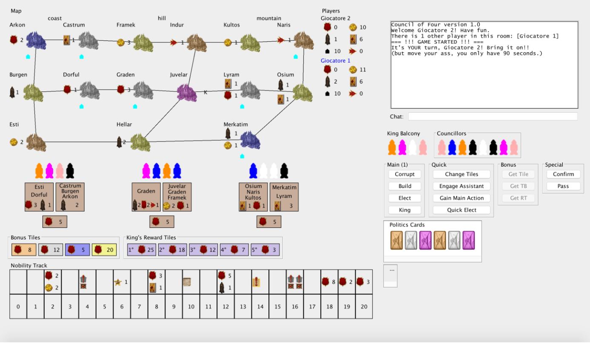

# council-of-four

Java implementation of the Council of Four board game, project for the 2016 Software Engineering course at Politecnico di Milano.

Developed by Michele Ferri, Alessio Mongelluzzo and Tommaso Massari.

## How to start the game

The game must be ran from Command Line Interface (CLI) in order to select the correct interface type and connection type. 
To do so, you can run GameServer.jar and GameClient.jar, which are located into the repository root, with the following commands:

`java -jar GameClient.jar`
`java -jar GameServer.jar`

While waiting for the game to start you can (both in CLI and GUI) rename yourself with the `rename <name>` command.

## How to play

* CLI: in order to know the information about your resources the basic instruction is `me`:

```
me

My name is Alessio
COLOR: blue
VICTORY POINTS: 0 COINS: 11 ASSISTANTS: 2 EMPORIUMS: 10
POLITICS CARDS: [BLUE, PINK, ORANGE, BLACK, BLUE, MAGENTA, WHITE]
PERMIT TILES:

NOBILITY POSITION: 0
CITIES: []
ACTIONS: 1 Main 1 Quick 0 sell 0 buy 0 get tb 0 get rt 0 get tile
```

The informations about cities can be reached with command `city`, then selecting which city you want to know about:

```
city
Which city? <Arkon Castrum Burgen Dorful Esti Framek Indur Graden Juvelar Hellar Kultos Naris Lyram Osium Merkatim>
Arkon

[City]
NAME: Arkon
REGION: coast
COLOR: blue
BONUS: Ax1
EMPORIUMS: 0
NEIGHBORS: Burgen Castrum
```

The command region displays all the infos concerned with regions.

```
region
Which region? <coast hill mountain>
mountain

[Region]

NAME: mountain
CITIES: [Kultos, Lyram, Merkatim, Naris, Osium]
BONUS: VPx5
available = true

BALCONY: [BLUE, MAGENTA, BLACK, WHITE]

PERMIT TILES:
[0]
CITIES: [Naris]
BONUS: Cx7
[1]
CITIES: [Merkatim, Naris]
BONUS: MAx1
```

Command actions gives you all the information on how to perform an action properly.

```
actions
MAIN ACTIONS
elect <region> <color>
corrupt <region> <visible tile number> <card color> <card color> ...
build <tile number> <city>
king <city> <card color> <card color> ...

QUICK ACTIONS
changetiles <region>
engageassistant
gainmainaction
qelect <region> <color>

SELL ACTION
sell

BUY ACTION
buy <entry number>

BONUS ACTIONS
get tile <region> <visible tile number>
get rt <city>
get tb <tile number>

PASS ACTION
pass
```

* GUI: the GUI contains some user-friendly buttons which allows players to perform any action:



In order to **elect** a councillor on a balcony, you can click on the councillor from the free councillors on the right and then click on the balcony.

If you want to **corrupt** a council and gain a permit tile you can click on the tile you want to pick and then select the politics cards you want to corrupt the council with:

If you want to deselct one of the cards you have selected, you can simply click on that card and the tick will disappear.

At the end of any action you will need to **confirm** in order to proceed.

More information can be found in *Presentation.pdf*.

*All the images and assets from the Council of Four board game belong to their respective owners.*